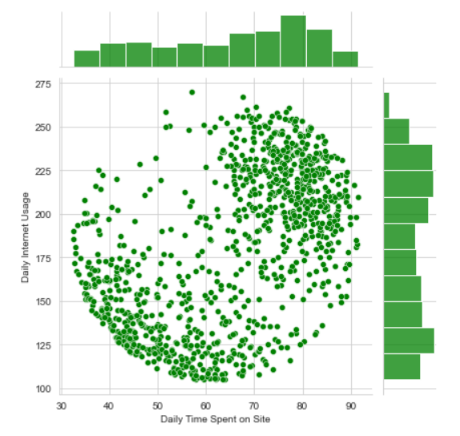

# Predicting Click on Advertisement - Logistic Regression

## Logistic Regression


Logistic regression is basically a **supervised classification algorithm**. In a classification problem, the target variable(or output), y, can take only discrete values for a given set of features(or inputs), X.

Contrary to popular belief, logistic regression is a regression model. The model builds a regression model to predict the probability that a given data entry belongs to the category numbered as “1”. Just like Linear regression assumes that the data follows a linear function, Logistic regression models the data using the **sigmoid function**. You can find a more formal definition on [Wikipedia](https://en.wikipedia.org/wiki/Logistic_regression).


## About Dataset - 

### Dataset Description
This file contains some information about whether user has clicked on that particular advertisement or not. It conatins details about how much time is spent on different sites, user's age and some more details.

This data set contains the following features:

- Daily Time Spent on Site : consumer time on site in minutes
- Age : cutomer age in years
- Area Income : Avg. Income of geographical area of consumer
- Daily Internet Usage : Avg. minutes a day consumer is on the internet
- Ad Topic Line : Headline of the advertisement
- City : City of consumer
- Male : Whether or not consumer was male
- Country : Country of consumer
- Timestamp : Time at which consumer clicked on Ad or closed window
- Clicked on Ad : 0 or 1 indicated clicking on Ad

You can access or download the dataset from [here](https://github.com/Deeshu-Jain/House-Price-Prediction-Model-USA-Using-Linear-Regression/blob/main/USA_Housing.csv).


## Content
**Predicting Click on Advertisement - Logistic Regression** 


In this project, we are working with a fake advertising data set, indicating whether or not a particular internet user clicked on an Advertisement. Exploratory Data Analysis is performed on the pre-cleaned dataset. Then a logistic regression model is created and trained that will predict whether or not they will click on an ad based off the features of that user.


## Instructions for Running Python Notebooks Locally
 
 - Install the required libraries in your Virtual Environment.

 - Run notebooks as usual by using a jupyter notebook server, Vscode etc.


## Libraries to Install
    
:white_check_mark: **Numpy** : [Numpy Installation](https://numpy.org/install/)

:white_check_mark: **Pandas** : [Pandas Installation](https://pandas.pydata.org/docs/getting_started/index.html)

:white_check_mark: **Matplotlib** : [Matplotlib Installation](https://matplotlib.org/stable/users/getting_started/)

:white_check_mark: **Seaborn** : [Seaborn Installation](https://seaborn.pydata.org/installing.html)

:white_check_mark: **Scikit-learn** : [Sklearn Installation](https://scikit-learn.org/stable/install.html#)


## Project Notebook

You can install Jupyter Notebook Environment from [here](https://jupyter.org/install) or through the [Anaconda Distribution](https://www.anaconda.com/products/distribution) or, can even use any IDE you like.

You can access the **Project Notebook** from [here](https://github.com/Deeshu-Jain/House-Price-Prediction-Model-USA-Using-Linear-Regression/blob/main/House%20Price%20Prediction%20Model%20(USA).ipynb).


## Code Snippet

```python
# Creating a histogram of the Age
sns.set_style('whitegrid')
data['Age'].hist(bins=30)
plt.xlabel('Age')
```


## Screenshots
Includes Screenshots of Some Visualization Figures, Classification Report




## Support My Work :wink:
You can feel free to comment on my projects, find the bugs :mag_right: or tell me what your thoughts about my coding, analysis and insight. You can also take some codes away if you think some of them can be useful for your projects :computer:. 
If you liked what you saw :blush:, want to have a chat with me about the portfolio, work opportunities, or collaboration, shoot :gun: an email at djjain844@gmail.com.

You can check out my portfolio here :v:.
